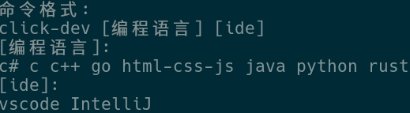

# 介绍

- **一键搭建开发环境,一键下载ide并生成对应的预设配置,节省你宝贵的时间**

# 开发环境

- 平台: x64

- 系统: Arch linux

- rust版本: 1.88.0

- ide: Rust Rover

# 已知问题

- **不支持 macos**

# 功能介绍

- **一键搭建开发环境,支持以下平台**

- **支持架构: x64**

- **支持平台: windows linux**

- **支持语言: C# c/c++ go html-css-js java python rust**

- **支持ide: vscode IntelliJ**

****

- **命令格式:**

# 安装

当前版本不稳定,稳定后会放出安装渠道

# 使用帮助

